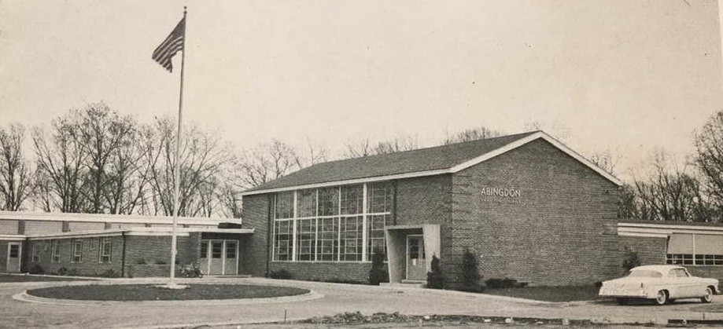

Abingdon first opened its doors to students in August 1950. The school has been in continuous operation since then, educating generations of students in South Arlington.

## Summary

The federal government built Fairlington during World War II as housing for workers at the recently-built Pentagon. Fairlington Elementary School (now the Fairlington Community Center) opened in 1944 to serve the families of those living in Fairlington. Following the war there was a "baby boom," and it became clear that Fairlington Elementary did not have sufficient capacity for the neighborhood's children. The Arlington School Board proposed building an addition to Fairlington Elementary, but [the neighborhood took a survey of families to show that such an addition would be overwhelmed by the number of children about to enter the school system](images/1947-10-22.png). As a result, the School Board opted to build a new school in North Fairlington - Abingdon Elementary School.

The groundbreaking ceremony for Abingdon Elementary was held on October 29, 1949. [Several future students participated by digging with shovels at the site where the school was going to be built](images/1949-11-04.jpg). Additionally, [several local dignitaries gave speeches](pdf/abingdon-groundbreaking.pdf), including School Board and County Board members.

[Abingdon was dedicated on August 20, 1950.](images/1950-08-21.png) Abingdon had ten classrooms, a multipurpose room (which served as a gym, cafeteria and a meeting place), as well as a front office, a principal's office, a nurse's office, and a teacher's lounge. [The original floor plan can be viewed here.](pdf/floor-plan-1949.pdf) All ten original classrooms still serve as classrooms today. The multipurpose room, which served as the cafeteria and the gymnasium, has since been divided into two classrooms currently used by preschool students.

Abingdon served only grades 1-3 in its first years, though it would accept grades 1-6 by the end of the decade. Despite only serving three grades, Abingdon was overcrowded in its first year. [Eight of ten classrooms had more than 35 students, and four classrooms had 46 or 47 students.](images/1950-11-21.jpg) This overcrowding would be relieved by the opening of Claremont Elementary in 1952. For the subsequent two decades, Abingdon would only admit students who lived in North Fairlington or Shirlington.

Abingdon was a lively school. [A parent handbook from 1957](pdf/parent-handbook-1957-1958.pdf) shows that there were several student volunteer organizations, including Safety Patrols and a Student Council. Parents were heavily involved from the start as well: [the school had the first parent volunteer crossing guards ("Mothers' Volunteer Patrol") in the country](images/1951-01-21_1.png), in addition to [a robust PTA](images/1951-09-01.png). The building also hosted several community events after the school day, including [dances for local teenagers](images/1950-09-22.jpg) and civic association meetings.

Abingdon was a segregated school in its first years. Black students were not allowed to enroll; Black students living in South Arlington attended Drew Elementary. Abingdon remained segregated long after the Supreme Court's 1954 ban on segregation in public schools, and Arlington's 1959 integration of Stratford Junior High, because [the apartment complexes that constituted Abingdon's attendance zone were openly discriminatory](images/1966-04-03.png). The Fair Housing Act of 1968 affirmed that housing discrimination was illegal, which paved the way for [the first three Black students to attend Abingdon in 1968](images/1969-05-13.jpg). One of these students stated that her time at Abingdon was difficult, but we know little else about Abingdon's integration.

Abingdon's student body became far more diverse in subsequent years. A busing program from nearby Green Valley ensured some diversity, and [refugees from Southeast Asia enrolled at the end of the Vietnam War](images/1975-09-12.png). Abingdon's student population was also bolstered by the closure of neighboring schools due to low enrollment: Fairlington Elementary closed for good in 1978, and Claremont Elementary closed in 1983 (though it would later reopen). All students at both schools attended Abingdon after the closures.

In 1985, [the Abingdon community came together to build a new playground](pdf/playground-dedication.pdf). The playground was designed by celebrity playground architect Robert Leathers, and was shaped like the United States. This was a significant event and a great source of pride for the community.

[Abingdon has had four renovations/additions since its construction in 1950](#renovations-and-additions), with the most recent renovation concluding in 2018. These additions from various eras can make Abingdon feel like a maze. Some of the exposed brick in the hallways near the front entrance used to be an exterior wall, before additions were built around it.

## Timeline

Below is a timeline of Abingdon's history gleaned from several sources, mostly newspaper articles. This timeline was largely made possible by a [newspaper digitizing project](https://library.arlingtonva.us/2021/06/21/search-thousands-of-historic-arlington-papers-online-for-free/) by Arlington Library's Center for Local History and the Library of Virginia.

| Date | Source | Narrative | Clip |
| ---- | ------ | --------- | ---- |
| 1943-12-18 | Arlington Daily | Fairlington Elementary School opened on January 3, 1944, in the building currently used as the Fairlington Community Center. The school served the Fairlington neighborhood before Abingdon opened six years later. |  |
| 1947-01-31 | Arlington Daily | This was the first known mention of what would become Abingdon Elementary. Fairlington PTA members supported building an elementary school on what was then known as the "North Fairlington site" to relieve overcrowding at Fairlington Elementary. |  |
| 1947-09-18 | Arlington Daily | An addition was planned for Fairlington Elementary, possibly as an alternative to Abingdon. |  |
| 1947-10-10 | Sun | Fairlington Elementary was overcrowded and residents wanted a school in North Fairlington. |  |
| 1947-10-12 | Washington Post | The Fairlington Civic Association polled North Fairlington residents and confirmed that they wanted a new school. |  |
| 1947-10-22 | Washington Post | The Fairlington Civic Association polled North Fairlington residents and confirmed that they wanted a new school. |  |
| 1948-02-16 | Washington Post | The new owners of Fairlington did not immediately turn over the land for the school to the county. |   |
| 1948-02-25 | Washington Post | The county continued to have trouble obtaining the land for Abingdon. |  |
| 1948-04-14 | Arlington Daily | The county hired attorneys to obtain the land for Abingdon. |  |
| 1948-12-30 | Sun | The county came to an agreement with landowners about the location and the price of the land on which Abingdon would be built. |  |
| 1949-01-28 | Sun | The Fairlington Civic Association and the Fairlington Elementary PTA issued a joint report about Abingdon's specifications. |  |
| 1949-06-17 | Washington Post | The county requested bids for the construction of Abingdon. |  |
| 1949-09-02 | Sun | The county accepted a bid for the construction of Abingdon. |  |
| 1949-10-02 | Washington Post | Abingdon's name was announced. |  |
| 1949-10-07 | Sun | Abingdon's name was announced. It was named for the [Abingdon plantation](https://en.wikipedia.org/wiki/Abingdon_(plantation)). |  |
| 1949-10-30 | Washington Post | Officials held a groundbreaking ceremony for Abingdon. This article includes an architect's rendering of what the school would look like upon completion. [More information about the groundbreaking is available in this document.](pdf/abingdon-groundbreaking.pdf) |  |
| 1949-11-04 | Sun | Officials held a groundbreaking ceremony for Abingdon. [More information about the groundbreaking is available in this document.](pdf/abingdon-groundbreaking.pdf) |  |
| 1950-06-02 | Sun | The Abingdon PTA held its first meeting on June 6, 1950. |  |
| 1950-06-23 | Sun | A photo of Abingdon's first principal. |  |
| 1950-08-18 | Sun | Officials announced the date and time of Abingdon's dedication. |  |
| 1950-08-21 | Washington Post | Abingdon was dedicated on August 20, 1950. |  |
| 1950-09-22 | Sun | This article includes the first of many mentions of social events that were held at Abingdon. |  |
| 1950-11-03 | Sun | A rare early photo of the school's interior. |  |
| 1950-11-21 | Sun | Classes at Abingdon were already overcrowded in its first year. Eight of ten classrooms had more than 35 students, and four classrooms had 46 or 47 students. |  |
| 1951-01-21 | Washington Star | Mothers of Abingdon students volunteered to serve as crossing guards so that their children could travel safely to and from school. This was the first such program in the country. |   |
| 1951-02-09 | Sun | There was evidence of property destruction at Abingdon after club dances. |  |
| 1951-02-17 | Washington Star | Abingdon PTA celebrated Founders Day, which commemorated the creation of the National PTA. This was a common celebration among PTA's in the 1950's. |  |
| 1951-04-22 | Washington Star | Abingdon students built a greenhouse. |  |
| 1951-06-22 | Sun | Abingdon's first principal departed after one year. |  |
| 1951-08-26 | Washington Post | Abingdon's second principal was announced. |  |
| 1951-11-01 | Washington Star | Abingdon students went on a field trip to the National Gallery of Art. |  |
| 1951-11-18 | Washington Star | The Abingdon PTA held a book fair. |  |
| 1951-12-16 | Washington Star | The Abingdon PTA held a bake sale. |  |
| 1951-1952  | [Project DAPS](https://projectdaps.org/items/show/660) | A PTA directory shows a robust organization in the school's second year. |  |
| 1953-08-23 | Washington Post | Abingdon's third principal was announced. |  |
| 1953-09-30 | Washington Star | [Jim Busby](https://en.wikipedia.org/wiki/Jim_Busby), a professional baseball player, visited Abingdon. |  |
| 1953-10-23 | Washington Star | The Abingdon PTA held a fall festival. |  |
| 1954-02-17 | Washington Star | The Abingdon PTA held a square dance. |  |
| 1955-03-01 | Washington Post | The Abingdon PTA held a panel discussion about racial integration. |  |
| 1955-06-02 | Sun | A jitterbug contest was held at Abingdon. |  |
| 1955-12-13 | Washington Post | The Fairlington Civic Association and the Abingdon PTA voted to oppose a state constitutional convention that was being organized to continue segregation in Virginia public schools. |  |
| 1956-07-27 | Daily Sun | A doll contest was held at Abingdon. |  |
| 1959-05-14 | Northern Virginia Sun | A festival being held at Abingdon was rained out. |  |
| 1961-01-30 | Northern Virginia Sun | Abingdon hired a new principal who would serve for ten years. |  |
| 1962-02-21 | Northern Virginia Sun | Abingdon students nervously watched John Glenn launch into space. |  |
| 1962-04-06 | Northern Virginia Sun | A costume show was held at Abingdon. |  |
| 1962-11-28 | Northern Virginia Sun | The county planned an addition at Abingdon that would add three or four classrooms and enlarge the library. |  |
| 1963-09-05 | Northern Virginia Sun | A planned addition would add a multi-purpose room for Abingdon and enlarge the library which at that point occupied a small, converted cloakroom. |  |
| 1963-10-28 | Northern Virginia Sun | A planned multi-purpose room would serve as a cafeteria, auditorium and gym. |  |
| 1964-02-20 | Northern Virginia Sun | A planned addition cited expectations for 14 elementary classrooms at Abingdon - it's not clear if that included the existing classrooms. |  |
| 1964-05-06 | [Project DAPS](https://projectdaps.org/items/show/1790) | A memo describing integration efforts in Arlington thus far stated that race had ceased to be a stated factor in student placement at this time. However, Abingdon and most other Arlington schools were still segregated due to school boundaries neatly matching settlement patterns in place due to housing discrimination. |   |
| 1964-05-18 | Northern Virginia Sun | A spring festival, with students dancing, was held at Abingdon. |  |
| 1964-05-28 | Northern Virginia Sun | Abingdon held a groundbreaking for its new addition. |  |
| 1964-10-01 | Northern Virginia Sun | Abingdon introduced its new kindergarten program. |  |
| 1965-01-11 | Northern Virginia Sun | Abingdon held a dedication for its new library. |  |
| 1965-06-09 | Center for Local History | A publication titled "A Long Range Staff Development Program to Facilitate Effective Integration in the Arlington County Public Schools" ([Library URL](https://libcat.arlingtonva.us/Record/18721)) drafted by the school system stated that there were no Black students at Abingdon in 1965. |  |
| 1966-04-01 | Northern Virginia Sun | Though not directly related to Abingdon, the article noted that there were only two Black families living in Fairlington. This would have made it difficult to meaningfully integrate Abingdon. |  |
| 1966-04-02 | Fairlington resident | Photos of a protest over housing discrimination in Fairlington, a policy which kept Abingdon segregated. |    |
| 1966-04-03 | Washington Post | An article describing the purported mechanics of racial discrimination in Fairlington, which kept Abingdon from integrating. |  |
| 1966-04-04 | Northern Virginia Sun | Segregation in Fairlington, which was then a rental community, kept Abingdon segregated long after the Supreme Court had ruled that public school segregation was against the law. |  |
| 1966-09-28 | Northern Virginia Sun | Abingdon's principal was given lifetime PTA membership. |  |
| 1967-08-04 | Northern Virginia Sun | Abingdon bought temporary classroms to relieve overcrowding. |  |
| 1967-10-19 | Northern Virginia Sun | Housing discrimination continued in Fairlington, which contributed to keeping Abingdon segregated. |   |
| 1968-03-18 | Washington Post | Abingdon's Fun Fair was advertised in the Washington Post. |  |
| 1968-05-25 | Northern Virginia Sun | Abingdon was slated to receive over a million dollars for a new addition in a bond referendum. |  |
| 1968-09-03 | Northern Virginia Sun | Some families with children who had been signed up to attend Abingdon and Fairlington were told that they would be bused to Drew. Some parents were unhappy about this. |   |
| 1968-09-04 | Northern Virginia Sun | Parents of children who were slated to be bused to Drew requested a School Board hearing. These were primarily Fairlington Elementary parents (not Abingdon parents), but some Abingdon students were slated to be bused as well. |   |
| 1968-09-05 | Northern Virginia Sun | An editorial supported the busing of Abingdon and Fairlington students to Drew to relieve overcrowding. |  |
| 1968-09-12 | Northern Virginia Sun | The Arlington School Board declined to intervene on behalf of Fairlington parents who objected to the busing of their children to Drew. |   |
| 1968-09-30 | Center for Local History | There were 51 "minority" students at Abingdon in 1968, and one Black teacher. |   |
| 1969-05-13 | Center for Local History | This critical document shows the year of integration of all schools in Arlington up to this point. Abingdon integrated in 1968 with three Black students. |  |
| 1969-06 | Abingdon Library | Yearbook photos from the 1968-1969 school year, showing the first Black students to enroll at Abingdon. |    |
| 1969-11-25 | Northern Virginia Sun | The Northern Virginia Service League (now the Junior League of Northern Virginia) held a presentation on a pilot program that is apparently similar to the modern-day Extended Day program. |  |
| 1969-11-26 | [Project DAPS](https://projectdaps.org/items/show/1421) | The racial breakdown of Abingdon students in 1969 is the first to count students of each race. |  |
| 1970-01-20 | Washington Post | The Abingdon PTA opposed integrating Drew by busing Abingdon students there. |  |
| 1971-04-15 | Northern Virginia Sun | A former principal of another Arlington school advocated for busing Abingdon students to Drew to relieve overcrowding. |  |
| 1971-05-03 | Northern Virginia Sun | A new school board member discussed busing Abingdon students to Drew to relieve overcrowding. |  |
| 1971-06-25 | [Project DAPS](https://projectdaps.org/files/show/483) | This is a snapshot of the demographics of Arlington elementary schools on the eve of a busing program aimed at racial integration of two formerly segregated schools. |  |
| 1971-07 | [Project DAPS](https://projectdaps.org/items/show/823) | This is a boundary map of Green Valley at the outset of Arlington's busing program. A section of Green Valley was slated to attend Abingdon. |  |
| 1974-09-17 | Washington Star | Abingdon lost electricity due to a squirrel short-circuiting a transformer. |  |
| 1974-12-18 | Northern Virginia Sun | This was the first mention of the potential closure of Fairlington Elementary School. |   |
| 1975-05-21 | Northern Virginia Sun | Abingdon hired a new principal. |  |
| 1975-05-21 | Northern Virginia Sun | Abingdon raised money for a field trip by collecting recycling. |  |
| 1975-09-12 | Washington Star | Abingdon enrolled refugees from Southeast Asia at the end of the Vietnam War. |  |
| 1977-03-23 | Northern Virginia Sun | Fairlington Elementary was restricted to grades 1-3. |  |
| 1978-11-15 | Washington Star | [Pearl Bailey](https://en.wikipedia.org/wiki/Pearl_Bailey) visited Abingdon. |   |
| 1978-12-08 | [Washington Post](https://www.washingtonpost.com/archive/local/1978/12/08/arlington-board-votes-to-shut-three-schools/2b460734-f0ad-415d-ad0b-94ac105107df/) | Fairlington Elementary was shut down, and remaining students enrolled in Abingdon starting in the fall of 1979. |  |
| 1983-06-17 | [Washington Post](https://www.washingtonpost.com/archive/local/1983/06/17/for-claremont-theres-no-tomorrow/3364fd7f-b1e4-4550-83c1-48a796f31c5a/) | Claremont Elementary was shut down, and remaining students enrolled in Abingdon starting in the fall of 1983. |   |
| 1983-07-01 | [Project DAPS](https://projectdaps.org/items/show/2177) | Attendance zones in Green Valley had changed in an attempt to reduce the impact of busing. Abingdon's attendance zone within Green Valley encompassed what had been the attendance zones of Fairlington and Claremont schools, which were now closed. |  |
| 1984-11-07 | [Washington Post](https://www.washingtonpost.com/archive/local/1984/11/07/volunteers-work-is-childs-play/ca319fea-11f5-4f64-befd-271dce5697f9/) | Abingdon students provided requirements to a celebrity playground architect. |   |
| 1984-11-18 | Washington Post | A feature in the Washington Post Magazine about students at Abingdon who were refugees from Southeast Asia. | [PDF](pdf/1984-11-18.pdf) |
| 1985-03-14 | Washington Post | The School Board proposed changes to Abingdon's school attendance boundaries. |  |
| 1986-09-05 | [Washington Post](https://www.washingtonpost.com/archive/lifestyle/1986/09/05/playgrounds-to-test-the-mind-and-body/36469714-86de-40e7-9f70-e8dd65cd5bb6/) | A description of Abingdon's playground, listed in an article titled "Playgrounds to Test the Mind and Body." | 
| 1986-12-03 | [Washington Post](https://www.washingtonpost.com/archive/local/1986/12/03/14-area-principals-honored-by-post/3b1a531d-a5fc-457e-98e8-dd862da126d7/) | Abingdon's principal was honored by the Washington Post. |  |
| 1987-09 | [Project DAPS](https://projectdaps.org/items/show/2169) | All elementary students living in Green Valley were sent to either Abingdon, Randolph or Barcroft at this time. Compulsory busing to other schools in the county had ceased. |  |
| 1988-02-19 | Washington Post | A plan was proposed to place sixth grade students in middle schools, and to reopen Claremont Elementary as an extension of Abingdon. |  |
| 1988-04-15 | [Washington Post](https://www.washingtonpost.com/archive/local/1988/04/15/school-plan-poorly-received/70d42adf-977d-4908-88de-ad2ffbbe032e/) | There was pushback to the plan to place sixth graders in middle schools and to reopen Claremont Elementary as an extension to Abingdon. (Claremont would reopen six years later.) |  |
| 1990-03-14 | Arlington Courier | Abingdon students collected money to build classrooms for Black students in South Africa as Apartheid was ending. |  |
| 1990-05-02 | Arlington Courier | Abingdon students draft and sign a school constitution. |  |
| 1990-05-16 | Arlington Courier | Abingdon students grow tomatoes from seeds that had been in space. |  |
| 1991-10-23 | [Washington Post](https://www.washingtonpost.com/archive/lifestyle/food/1991/10/23/a-little-hands-on-harvest/1ccb80df-cb15-4e72-99a2-c27933032992/) | A feature about Abingdon's school garden. |   |
| 1992-11 | [American Horticulturist](https://ahsgardening.org/wp-content/pdfs/1992-11r.pdf#page=10) | A feature about Abingdon's school garden. | [PDF](pdf/1992-11.pdf#page=10) |
| 1993-11-30 | Washington Post | Abingdon's principal was honored for distinguished leadership. |  |
| 1994-03-24 | [Washington Post](https://www.washingtonpost.com/archive/local/1994/03/24/school-boundary-revisions-leave-frustrations/c206cf80-5735-4186-a1f1-a8e72f1c6635/) | Gunston Middle School re-opened after having been closed in 1978, and Abingdon families were excited to send their kids there. Also, Claremont Elementary reopened, which reduced crowding at Abingdon. |   |
| 1995-12-03 | [Washington Post](https://www.washingtonpost.com/archive/local/1995/12/03/in-step-with-her-students/92e7c073-7a7f-494a-882d-d55805f20721/) | A profile of race walking Abingdon teacher. |   |
| 1996-09-01 | Washington Post | A list of quotes from Abingdon staff. |  |
| 1999-04-01 | [Washington Post](https://www.washingtonpost.com/archive/local/1999/04/01/speaking-childrens-language/e24488ec-32df-43f0-afeb-2ff6eb5120c5/) | A profile of Abingdon's bilingual program. |   |
| 2001-03-29 | Washington Post | A profile of a first-year teacher. |   |
| 2002-01-03 | [Washington Post](https://www.washingtonpost.com/archive/local/2002/01/03/schools-may-merge-spanish-language-programs/a891da84-7d31-4308-add4-df124e50ba2d/) | The school board considered moving Abingdon's bilingual education program. |   |
| 2002-02-14 | [Connection Newspapers](http://www.connectionnewspapers.com/news/2002/feb/14/schools-consider-one-more-all-spanish-school/) | The school board considered moving Abingdon's bilingual education program. | |
| 2006-11-06 | [Washington Post](https://www.washingtonpost.com/archive/local/2006/11/16/2-principals-honored-for-reviving-schools-span-classbankhead18-administrators-receive-post-awards-span/36f6db9a-5fed-4fcc-8f15-6a8fac56acee/) | Abingdon's principal was named Principal of the Year. | [PDF](pdf/2006-11-06.pdf) |
| 2006-12-10 | [Connection Newspapers](http://www.connectionnewspapers.com/news/2006/dec/10/principal-of-the-year-pushes-abingdon-forward/) | Abingdon's principal was named Principal of the Year. | |
| 2007-06-18 | [Connection Newspapers](http://www.connectionnewspapers.com/news/2007/jun/18/building-knowledge/) | A profile of Abingdon's architecture program. | |
| 2007-09 | Northern Virginia Magazine | Abingdon PTA worked to diversify its membership and boost participation. | [PDF](pdf/2007-09-01.pdf) |
| 2009-06-27 | [Sun-Gazette](https://www.insidenova.com/news/education/arlington/abingdon-elementary-wins-video-award/article_8ec52a92-febe-5519-b4d0-faa1f2adba13.html) | Abingdon received an award for a student-produced video. [Youtube link to video](https://www.youtube.com/watch?v=RzFa_JeHKVM) | |
| 2010-06-04 | [Sun-Gazette](https://www.insidenova.com/news/education/arlington/alpaca-poop-helps-to-fertilize-outdoor-classroom/article_ad096b40-e45c-5fe6-9760-e1a5a3203596.html) | Abingdon received a donation of Alpaca poop to help fertilize its garden. | |
| 2011-10-11 | [Sun-Gazette](https://www.insidenova.com/news/arlington/county-schools-honored-for-commitment-to-hunger-issues/article_4b617761-207c-5148-91ec-00fb98677f25.html) | Abingdon was honored for its commitment to fighting hunger through its food drives and donations from its garden. [Archived information available here.](https://web.archive.org/web/20111002042353/http://www.schoolsfighthunger.org/school/66338-abingdon-elemetnary.html) | |
| 2011-11 | [APS](https://www.apsva.us/wp-content/uploads/2021/04/Abingdon_Glebe_Nottingham.pdf#page=3) | APS published a feasibility study that recommended demolishing Abingdon and building a new school on the front field. | |
| 2012-08-13 | [Washington Post](https://www.washingtonpost.com/local/education/mobile-library-keeps-some-arlington-kids-reading-all-summer/2012/08/12/cc4c91b8-e2f4-11e1-a25e-15067bb31849_story.html) | Abingdon's Book Bus brings books to students during the summer. | [PDF](pdf/2012-08-13.pdf) |
| 2012-08-13 | [ArlNow](https://www.arlnow.com/2012/08/13/abingdon-elementary-summer-book-bus-deemed-a-success/) | Abingdon's Book Bus brings books to students during the summer. | |
| 2014-05-18 | [Washington Post](https://www.washingtonpost.com/local/education/tablets-proliferate-in-nations-classrooms-and-take-a-swipe-at-the-status-quo/2014/05/17/faa27ba4-dbbd-11e3-8009-71de85b9c527_story.html) | Tablets were beginning to be used at Abingdon. | [PDF](pdf/2014-05-18.pdf) |
| 2014-07-10 | [Sun-Gazette](https://www.insidenova.com/news/arlington/arlington-school-officials-detail-costs-of-new-construction/article_c794bd86-081c-11e4-b042-0019bb2963f4.html) | The first article to describe the renovation that would take place in 2016-2017. | |
| 2014-07-13 | [Sun-Gazette](https://www.insidenova.com/news/arlington/arlington-educators-present-at-international-reading-conference/article_239f8fa0-0a8b-11e4-87b1-0019bb2963f4.html) | Abingdon staff spoke about the Book Bus at an international reading conference. | |
| 2014-08-31 | [Sun-Gazette](https://www.insidenova.com/news/arlington/architect-for-expansion-of-arlington-elementary-school-to-be-approved/article_1068b6b2-3111-11e4-add1-001a4bcf887a.html) | The School Board selected an architect for Abingdon's renovation. | |
| 2015-02-16 | [Sun-Gazette](https://www.insidenova.com/news/arlington/arlington-school-board-members-to-discuss-planned-abingdon-expansion/article_edfbb848-b551-11e4-9578-db292f4f42f8.html) | Arlington School Board members discuss the planned Abingdon renovation. | |
| 2015-03-23 | [Sun-Gazette](https://www.insidenova.com/news/arlington/abingdon-elementary-expansion-plan-approved/article_5ec06abe-d173-11e4-96de-cbff92342826.html) | The School Board approved conceptual designs for Abingdon's renovation. | |
| 2015-09-22 | [Sun-Gazette](https://www.insidenova.com/news/arlington/arlington-county-board-oks-expansion-of-abingdon-elementary/article_c8237516-611d-11e5-9aa9-7bdbcdc7f118.html) | The County Board approved Abingdon's renovation. | |
| 2015-09-22 | [ArlNow](https://www.arlnow.com/2015/09/22/abingdon-elementary-to-be-expanded-renovated/) | An article described Abingdon's planned renovation. | |
| 2015-10-14 | [Washington Post](https://www.washingtonpost.com/local/arlington-school-counselor-and-teacher-pen-book-about-traveling-cat/2015/10/13/67b5e1fe-6d08-11e5-aa5b-f78a98956699_story.html) | An Abingdon teacher illustrated a book. | [PDF](pdf/2015-10-14.pdf) |
| 2016-02-22 | [Sun-Gazette](https://www.insidenova.com/news/arlington/final-design-for-elementary-school-expansion-nears-approval/article_c40b17ce-d8ad-11e5-8dbf-bf42c7855651.html) | The School Board was close to approving Abingdon's final renovation plans. | |
| 2016-04-05 | [ArlNow](https://www.arlnow.com/2016/04/05/relocatable-classrooms-at-abingdon-relocated-to-field/) | Relocatable classrooms were placed next to Abingdon in preparation for the renovation. | |
| 2017-05-18 | [Sun-Gazette](https://www.insidenova.com/news/arlington/progress-continues-on-abingdon-elementary-rebuild/article_200d430a-3bc0-11e7-b2f7-43bebb6ab0a7.html) | Progress continued on Abingdon's renovation. | |
| 2017-11-06 | [ArlNow](https://www.arlnow.com/2017/11/06/abingdon-elementarys-little-presidents-get-a-visit-from-nationals-racing-presidents/) | Washington Nationals’ racing presidents paid a surprise visit to Abingdon and partied with Abingdon's own "Little Presidents." | |
| 2018-04-13 | [ArlNow](https://www.arlnow.com/2018/04/13/morning-notes-1882/) | Abingdon had a ribbon cutting for their completed renovations. | |
| 2018-06-12 | [ArlNow](https://www.arlnow.com/2018/06/12/abingdon-elementarys-little-presidents-join-nats-park-presidents-race/) | Abingdon’s "Little Presidents" visit Nationals Park to be on the field with the Nationals' presidents. | |
| 2018-12-06 | [Washington Post](https://www.washingtonpost.com/local/education/as-arlington-rezones-schools-communities-fight-to-stay-together/2018/12/05/97102b7c-f337-11e8-80d0-f7e1948d55f4_story.html) | Changes to Abingdon's boundaries were divisive. | [PDF](pdf/2018-12-06.pdf) |
| 2019-06-22 | [APS](https://web.archive.org/web/20210113110932/https://www.apsva.us/post/school-board-appoints-new-abingdon-principal/) | Abingdon hired a new principal. | |
| 2019-12-11 | [Good Morning America](https://www.goodmorningamerica.com/living/story/stem-program-girls-rosie-riveters-list-fulfilled-amazon-67608034) | Good Morning America recorded a segment at Abingdon in which they and Amazon donated products to Abingdon. | |
| 2022-09-20 | [Amazon](https://www.aboutamazon.com/news/community/amazon-alleviating-hunger-for-students-throughout-hq2-region) | Amazon donated money for snack baskets in Abingdon classrooms. | |
| 2024-08-15 | [APS](https://www.apsva.us/post/school-board-appoints-new-staff-including-abingdon-elementary-school-principal/) | Abingdon hired a new principal. |

## Documents

The documents below reveal important information about what Abingdon was like in decades past. They were mostly obtained from Arlington Library’s Center for Local History.

| Date | Source | Document | Link |
| ---- | ------ | -------- | ---- |
| 1947-10-20 | [Arlington Library](/archive/files/25.pdf) | The results of a community-led, Fairlington-wide census to prove the need for a second elementary school in Fairlington. (Abingdon was built as a result.) | [PDF](pdf/school-census.pdf) |
| 1940's | [Arlington Library](/archive/files/25.pdf) | A flyer advocating for the inclusion of grades 4-6 in what would become Abingdon Elementary. | [PDF](pdf/grades-4-6-expansion-survey.pdf) |
| 1949-10-29 | [Arlington Library](https://libraryarchives.arlingtonva.us/Detail/collections/1096) | Speeches and flyers for Abingdon's groundbreaking ceremony. | [PDF](pdf/abingdon-groundbreaking.pdf) |
| 1957-1958 | [Arlington Library](https://ead.lib.virginia.edu/vivaxtf/view?docId=arlington/ViAr00169.xml) | Handbook for Abingdon parents. | [PDF](pdf/parent-handbook-1957-1958.pdf) |
| 1958-1975 | [Arlington Library](https://ead.lib.virginia.edu/vivaxtf/view?docId=arlington/ViAr00169.xml) | Reports and other documents from Abingdon nurses. | [PDF](pdf/nurse-file.pdf) |
| 1968 | [Arlington Library](https://libcat.arlingtonva.us/Record/10555) | Architectural and mechanical report for proposed additions and alterations to Oakridge and Abingdon elementary schools. | [PDF](pdf/addition-plan-1968.pdf) |
| 1971-03 | [Arlington Library](/archive/files/25.pdf) | A history of Abingdon Elementary. | [PDF](pdf/abingdon-elementary-history.pdf) |
| 1976 | [Arlington Library](/archive/files/25.pdf) | A memo about Abingdon's diversity. | [PDF](pdf/multicultural-abingdon.pdf) |
| 1983-09 | Fairlington resident | A document about Abingdon found in promotional material provided by a Fairlington realtor. | [PDF](pdf/1983-09.pdf) |
| 1985 | Fairlington resident | Pamphlets soliciting assistance in building the new Abingdon playground. | [PDF](pdf/playground-pamphlets.pdf) |
| 1985-04-01 | Fairlington resident | The Fairlington Civic Association newsletter documenting the construction of the new Abingdon playground. | [PDF](pdf/playground-fca-bulletin.pdf) |
| 1985-05-04 | Fairlington resident | A document dedicating the Abingdon playground constructed by the community. | [PDF](pdf/playground-dedication.pdf) |
| 2009-2011 | [Abingdon PTA](https://web.archive.org/web/20230307213801/https://sites.google.com/site/abingdonpta/the-little-bird-el-parajito) | Little Bird PTA Newsletters for September 2009 to April 2011. | [PDF](pdf/little-bird.pdf) |
| 2015 | Fairlington resident | A cookbook with recipes from the Abingdon community. | [PDF](pdf/ABINGDONCOOKBOOK.SP.final.nocrops.pdf) |

### Yearbooks

| Date | Source | Link |
| ---- | ------ | ---- |
| 1957-1958 | Abingdon graduate | [PDF](pdf/yearbook-1957-1958.pdf) |
| 1959-1960 | Abingdon Library | [PDF](pdf/yearbook-1959-1960.pdf) |
| 1960-1961 | Abingdon Library | [PDF](pdf/yearbook-1960-1961.pdf) |
| 1961-1962 | Abingdon Library | [PDF](pdf/yearbook-1961-1962.pdf) |
| 1962-1963 | Abingdon Library | [PDF](pdf/yearbook-1962-1963.pdf) |
| 1964-1965 | Abingdon Library | [PDF](pdf/yearbook-1964-1965.pdf) |
| 1965-1966 | Abingdon Library | [PDF](pdf/yearbook-1965-1966.pdf) |
| 1966-1967 | Abingdon Library | [PDF](pdf/yearbook-1966-1967.pdf) |
| 1967-1968 | Abingdon Library | [PDF](pdf/yearbook-1967-1968.pdf) |
| 1968-1969 | Abingdon Library | [PDF](pdf/yearbook-1968-1969.pdf) |
| 1969-1970 | Abingdon Library | [PDF](pdf/yearbook-1969-1970.pdf) |
| 1970-1971 | Abingdon Library | [PDF](pdf/yearbook-1970-1971.pdf) |

## Other Information

### Renovations and Additions

If you've ever walked Abingdon's labyrinthine hallways, it's obvious that the building has been added on to many times.

| Year | Added |
| ---- | ----- |
| 1949-1950 | Initial construction. Ten classrooms, a multi-purpose room, a library, offices for the principal and secretary, a teacher's lounge, a kitchen and a storage room. [View the floor plan here.](pdf/floor-plan-1949.pdf) |
| 1964-1965 | 4 additional classrooms, a new multipurpose room, and likely reconfiguring the old multipurpose room as a library. |
| 1970-1971 | 15 additional classrooms(?), media center, gymnasium, conference rooms for reading, music, science, art, an office and additional storage space. And air conditioning for the entire school except the gym. [View the floor plan here.](pdf/floor-plan-1974.pdf)  |
| 1990-1991 | Added classrooms, a computer lab, and a front office and new front entrance to the east side of the school. [View the floor plan here.](https://www.boarddocs.com/vsba/arlington/Board.nsf/files/9UMFQQ7D9DE7/$file/G-2%20Abingdon%20Concept%20Package.pdf#page=25) |
| [2016-2017](https://www.apsva.us/design-and-construction/abingdon-additionrenovations/) | 12 new classrooms, a new gymnasium, a new kitchen, and an outdoor instructional area. [View the floor plan here.](https://www.boarddocs.com/vsba/arlington/Board.nsf/files/A7LUNQ745E3C/$file/F-3%20Action%20-%20Abingdon%20Final%20Design%20Book%20v4.pdf#page=27) |

### Principals

| Name | Tenure |
| ---- | ------ |
| Mary Barbour | 1950-1951 |
| Patty Hales | 1951-1953 |
| Corinne Jeffries | 1953-1960? |
| Dicie Woodson | 1960?-1961? |
| Irene B. Young | 1961-1971 |
| John Kiernan | 1971-1975 |
| James Kacsmarik | 1975-? |
| Margaret McCourt-Dirner | 1982-?, 1986 |
| Marjorie "Meg" R. Tuccillo | 1990-1997 |
| Pat Anderson | 1997?-1998? |
| Miguel Ley | 1998-2001 |
| Joanne Uyeda | 2001-2019 |
| David Horak | 2019-2024 |
| Edwin Acevedo | 2024-present |

### Grades present

| Timeframe | Grades |
| --------- | ------ |
| 1950-195? | 1-3    |
| 195?-1959 | 1-5    |
| 1959-1965 | 1-6    |
| 1965-1990 | K-6    |
| 1990-1995 | K-5    |
| 1995-present | PK-5 |

## Photos

### 1950's Photos from Facebook

These photos from the 1950's were found on a Facebook group called "[I grew up in Fairlington!](https://www.facebook.com/groups/381712054921)" They are the only known photos of the outside of the original school building. They also show a Halloween parade.









### 1970's Photo Album

Abingdon's librarian, Meghan Fatouros, provided the PTA with a box of old documents and photos. Among these was a photo album chronicling life at Abingdon in the late 1970's.
















































### 1985 Playground Construction

The photos below show the construction of the "Leathers Playground" in April 1985. The playground was designed by Robert Leathers, a celebrity playground architect whose designs were constructed over multiple days by hundreds of community volunteers. ([The Washington Post published an article describing some of Abingdon's planning efforts.](https://www.washingtonpost.com/archive/local/1984/11/07/volunteers-work-is-childs-play/ca319fea-11f5-4f64-befd-271dce5697f9/)) For additional information about the 1985 playground, see the [dedication document](pdf/playground-dedication.pdf) and the [community newsletter](pdf/playground-fca-bulletin.pdf) in the documents section.

The following photos and flyers were provided by Meghan Fatouros, Abingdon's librarian. They were contained in a scrapbook stored in Abingdon's library.






































































































































































































































The following photos were provided by Terry Placek, who served on the construction team's "Food Committee," ensuring that the volunteers were well-fed as they built Abingdon's new playground.












### 1991 Renovations and Guest Readers

Abingdon's librarian, Meghan Fatouros, provided the PTA with a box of old documents and photos. Among these were three rolls of film from about 1991 which show a renovation/addition to the school being built, as well as visitors reading to students.




















<!----><!---->

<!----><!----><!---->











<!---->





































<!----><!----><!---->

### Mid 1990's Classroom

Abingdon's librarian, Meghan Fatouros, provided the PTA with a box of old documents and photos. Among these was were undated classroom photos, likely from the mid-1990's.

























### October 1994 Classroom

Abingdon's librarian, Meghan Fatouros, provided the PTA with a box of old documents and photos. Among these were classroom photos from film developed in October 1994.





<!---->


<!---->

### September 1995 Outdoor Lab and Field Trip

Abingdon's librarian, Meghan Fatouros, provided the PTA with a box of old documents and photos. Among these were photos developed in September 1995 showing a trip to the Outdoor Lab, and likely to a historical site as well.























































### March 1996 Military Equipment

Abingdon's librarian, Meghan Fatouros, provided the PTA with a box of old documents and photos. Among these were photos developed in March 1996 show students trying on military equipment for some reason, as well as a couple of playground photos.























